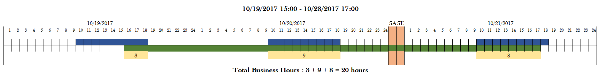
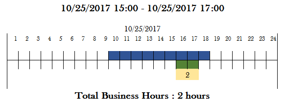
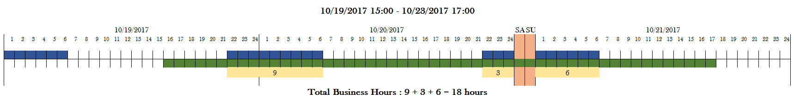
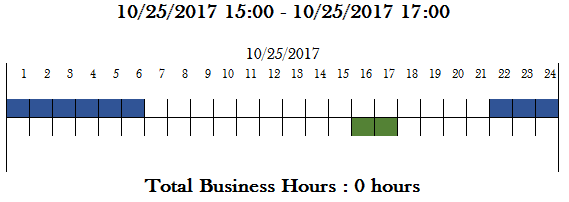

```{r setup, include=FALSE}
knitr::opts_chunk$set(echo = TRUE)
library(bizhours)
```

***

## Purpose of the document
***
***

In this document we will try to use the package `bizhours` and also check the output of function `bizhours` for correctness. We will check the output from function `bizhours` for different values for the following parameters 

* `start_time` : The start time of the work shift
* `end_time` : The end time of the work shift

***

## Using `bizhours`
***
***

Let's first create the variables - `from` and `to` to be used as the parameters `from_dates` and `to_dates` of function `bizhours`  

```{r variables}
from <- c(as.POSIXct(x = "10/19/2017 15:00", format = "%m/%d/%Y %H:%M"), 
          as.POSIXct(x = "10/25/2017 15:00", format = "%m/%d/%Y %H:%M")
          )
to <- c(as.POSIXct(x = "10/23/2017 17:00", format = "%m/%d/%Y %H:%M"), 
        as.POSIXct(x = "10/25/2017 17:00", format = "%m/%d/%Y %H:%M")
        )
from
to
```

In this example, both date times have the same start time and end time for their shifts - 15:00 and 17:00 hours respectively. 
We can now test two different scenarios of calculating business hours by altering specific 
parameters and checking the returned business hours for correctness.

As we are not altering any of the additional parameters of the function, the default calendar and timezone 
will be used. This considers saturday and sunday as holidays and also a list of holidays specified by 
`holidaysANBIMA` within the `bizdays` package. The default timezone is an empty string "" which tells
R to pick the default timezone of the system.

***

### Scenario 1 (Day Shift)
A work shift of 9:00 AM to 6:00 PM. 

#### Expected Results

*Below two images show dates plotted on a number line and days split into 24 hours. Blue shows work timings, green shows the from and to date for which we are calculating and the numbers in yellow show the overlaps which also translates to business hours.*

10/19/2017 15:00 - 10/23/2017 17:00



*Saturday and Sunday are considered holidays.*

10/25/2017 15:00 - 10/25/2017 17:00



#### Calculated Results

```{r scenario_1}
bizhours(from_dates = from, to_dates = to, start_time = "09:00", end_time = "18:00")
```

***

### Scenario 2 (Night Shift)
A work night-shift of 9:00 PM to 6:00 AM. 

#### Expected Results
*Below two images show dates plotted on a number line and days split into 24 hours. Blue shows work timings, green shows the from and to date for which we are calculating and the numbers in yellow show the overlaps which also translates to business hours.*

10/19/2017 15:00 - 10/23/2017 17:00



*Saturday and Sunday are considered holidays.*

10/25/2017 15:00 - 10/25/2017 17:00



#### Calculated Results

```{r scenario_2}
bizhours(from_dates = from, to_dates = to, start_time = "21:00", end_time = "6:00")
```


